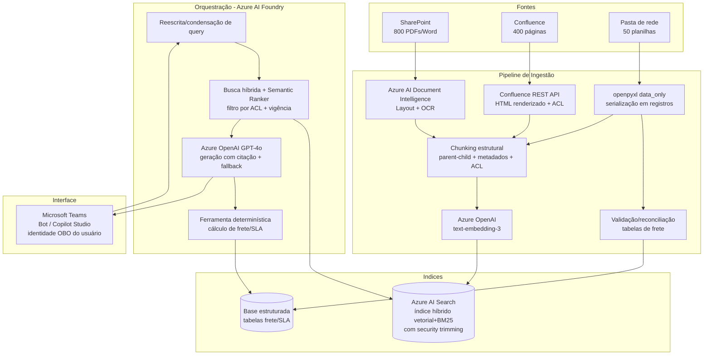

# Avaliação de Viabilidade Técnica — Assistente de IA NovaTech

**Cliente:** NovaTech (setor de logística, médio porte, 1.200 funcionários)
**Prestador:** DB1 Group
**Documento:** Technical Feasibility Assessment
**Versão:** 1.1 — Discovery (revisão de arquitetura)
**Classificação:** Confidencial — uso interno DB1/NovaTech

---

> ## Nota de revisão (v1.0 → v1.1)
> Esta versão incorpora uma revisão crítica de arquitetura. As principais mudanças:
> - **Os "dois fatores condicionantes" viraram três:** governança documental, **engenharia da base estruturada de frete** (antes tratada como subproduto da ingestão) e **segurança/ACL + LGPD** (antes subdimensionada).
> - **Dimensionamento de tokens corrigido** para o fator de tokenização do português (Seção 4).
> - **ROI reapresentado como banda com curva de adoção** (Seção 10), substituindo o ponto único otimista.
> - **Roadmap refeito em fases** com recorte de escopo para o go-live (Seção 11); o prazo de 3 meses original era incompatível com o próprio diagnóstico de risco.
> - Novas mitigações: reescrita de query/multi-hop, *tier* de risco para conteúdo narrativo, recência ≠ autoridade, teste de regressão na reindexação, fluxo OBO de permissões, caminho de *fallback*/escalonamento, e o custo de operação humana no TCO.

---

## 1. Sumário Executivo

A NovaTech deseja um assistente de IA que permita aos 45 atendentes consultar, em linguagem natural, a documentação operacional oficial (manuais, políticas de compliance, tabelas de SLA, regras de frete e normas de segurança de carga), reduzindo o tempo médio de busca por chamado de **12 para menos de 2 minutos** e padronizando as respostas.

**Veredito:** o projeto é **tecnicamente viável** dentro do ecossistema Azure + Microsoft 365 já licenciado pela NovaTech, com arquitetura RAG (Retrieval-Augmented Generation) sobre Azure AI Search e Azure OpenAI (GPT-4o), integrado ao Teams. A viabilidade, contudo, é **condicionada** a três fatores que estão majoritariamente **fora da camada de modelo** — é neles, e não no LLM, que reside o risco do projeto:

1. **Heterogeneidade e qualidade das fontes** — tabelas complexas, PDFs escaneados, macros de Confluence e planilhas com fórmulas exigem um pipeline de ingestão sofisticado. RAG ingênuo (extração de texto puro + chunking fixo) produzirá respostas erradas em dados numéricos críticos (frete, SLA), o que é inaceitável em logística.
2. **Engenharia da base estruturada de frete/SLA** — a arquitetura híbrida depende de extrair as tabelas de alto risco para uma base consultável e determinística. **Isto não é um subproduto da ingestão; é um subprojeto de ETL/modelagem de dados** com seus próprios desafios: modelar regras de 15+ dimensões, manter sincronia mensal, sobreviver a mudanças de estrutura das planilhas e — crítico — **validar que a extração está correta** (um número de frete errado é a falha catastrófica que este documento existe para evitar).
3. **Governança documental** — a base é atualizada mensalmente por três áreas sem processo unificado e **contém contradições entre versões**. Nenhum modelo de IA resolve fontes contraditórias: ele apenas reproduz a contradição com confiança. Este é um problema de processo, não de tecnologia, e precisa ser endereçado em paralelo.

A esses três soma-se um eixo transversal que foi **subestimado na v1.0 e elevado a risco Alto** nesta revisão: **segurança/controle de acesso (ACL) e conformidade com a LGPD** (Seção 8.3).

A recomendação é prosseguir adotando uma arquitetura **híbrida** (RAG para conteúdo narrativo + consulta estruturada/determinística para tabelas e cálculo de frete), tratando a governança de fontes **e** a base estruturada como entregáveis de primeira classe, e **faseando o escopo** — o prazo de 3 meses só é plausível para um go-live de escopo reduzido (Seção 11).

> **Observação sobre estimativas de custo e preços:** os valores de pricing de Azure citados na Seção 9 são aproximados e mudam com frequência. Devem ser confirmados na calculadora oficial da Microsoft e em proposta comercial dedicada antes de qualquer compromisso contratual. **O maior componente de TCO não está na nuvem, e sim na operação humana recorrente** (curadoria, validação de OCR, manutenção da base de frete) — ver Seção 9.

---

## 2. Contexto e Escopo

| Item | Situação atual |
|---|---|
| Volume de chamados | ~320/dia; **~60% (192/dia)** envolvem consulta a documentação |
| Equipe impactada | 45 atendentes |
| Tempo médio de busca | 12 min/chamado → **meta: < 2 min** *(ver ressalva na Seção 10 sobre origem e confiabilidade desse baseline)* |
| Fontes | SharePoint (~800 PDFs/Word), Confluence (~400 páginas), pasta de rede (~50 planilhas, atualização mensal) |
| Atualização | Mensal, por Operações, Compliance e Comercial — **sem revisão unificada** |
| Licenciamento | Microsoft 365 E3 já contratado; disposição para provisionar Azure AI Services |
| Integração-alvo | Microsoft Teams + SharePoint |
| Prazo | 3 meses (discovery + desenvolvimento + go-live) — **viável apenas com escopo faseado (Seção 11)** |

**Fora de escopo nesta fase:** automação de respostas ao cliente final (o assistente apoia o atendente humano, não o substitui), reescrita da documentação de origem, e unificação técnica das três áreas produtoras de conteúdo.

**Premissas a validar no discovery (se falsas, mudam o plano):** (a) a atualização das fontes é de fato apenas mensal — frete/SLA frequentemente mudam fora de ciclo (sobretaxa de combustível, reroteamento emergencial); (b) o baseline de 12 min é medido, não autorrelatado; (c) o percentual de PDFs escaneados; (d) a estabilidade estrutural das planilhas de frete entre meses.

---

## 3. Análise das Fontes de Dados

Esta é a seção de maior densidade de risco. Cada tipo de fonte impõe um desafio distinto ao pipeline de RAG. A regra central: **a qualidade da resposta nunca supera a qualidade da extração.** Se a etapa de ingestão corromper a estrutura de uma tabela de frete, nenhum reranker ou prompt salvará a resposta.

### 3.1 PDFs com tabelas complexas (tabelas de frete com 15+ colunas)

**Desafio para o pipeline.** Extratores de texto convencionais (PyPDF, pdfminer) leem o PDF como fluxo de caracteres e **perdem a topologia da tabela**: células se misturam entre linhas, o cabeçalho deixa de estar associado ao valor, e uma tabela de 15 colunas vira uma sopa de números sem rótulo. Ao fatiar (chunking) esse texto, a probabilidade de cortar uma tabela no meio é alta.

**Impacto na qualidade das respostas.** Crítico. Em logística, a resposta "qual o frete para a faixa de peso X, região Y, cliente tipo Z" depende da interseção exata linha×coluna. Uma tabela mal extraída produz a alucinação mais perigosa que existe: um **número plausível, porém errado**. O atendente não tem como auditar e repassa o valor ao cliente.

**Estratégia de tratamento.**
- Usar **Azure AI Document Intelligence (modelo Layout)** para extrair tabelas como objetos estruturados (linha/coluna/célula com coordenadas), não como texto corrido.
- **Serializar cada tabela para Markdown/HTML** preservando o cabeçalho, e manter a tabela inteira como **um único chunk** (table-aware chunking), repetindo o cabeçalho em cada fragmento caso a tabela seja grande demais para um chunk.
- Para as tabelas de frete de alto risco, ir além do RAG: extrair os dados para uma **base estruturada consultável** (ver Seção 6.3 e 7.4) e responder via lookup determinístico, não por similaridade vetorial.
- **Validação obrigatória da extração** (novo): toda tabela de frete extraída para a base estruturada deve passar por reconciliação automática contra a fonte (checksums por linha/total, *spot-check* humano amostral). Sem isso, a base determinística pode estar errada com a mesma confiança da alucinação que ela deveria prevenir — ver Seção 7.4 e 8.4.

### 3.2 PDFs escaneados (OCR necessário)

**Desafio para o pipeline.** Não há camada de texto — são imagens. Sem OCR, o documento é invisível para o RAG. Com OCR, surgem erros de reconhecimento, especialmente em **números, unidades e caracteres especiais** (um "0" vira "O", "8" vira "B"), exatamente os dados mais sensíveis em frete e SLA.

**Impacto na qualidade das respostas.** Duplo. Texto ruidoso gera **embeddings de baixa qualidade** (o chunk não é recuperado quando deveria) e, quando recuperado, **transporta o erro numérico** para a resposta.

**Estratégia de tratamento.**
- **Azure AI Document Intelligence (modelo Read/OCR)** com extração de **score de confiança** por região.
- **Quality gate na ingestão:** documentos ou trechos abaixo de um limiar de confiança são marcados (`needs_review`) e não entram no índice até validação humana, ou entram com flag de baixa confiança exibida na resposta.
- Inventariar quantos dos 800 PDFs são escaneados logo no discovery — isso muda materialmente o esforço de ingestão **e o custo recorrente da fila de revisão humana** (Seção 9).

### 3.3 Wiki Confluence (links internos + macros customizadas)

**Desafio para o pipeline.** Dois problemas. (a) **Links internos** criam contexto distribuído: uma página de "política de devolução" pode depender de uma página linkada de "prazos por região"; ao fatiar isoladamente, o chunk perde a referência. (b) **Macros customizadas** renderizam conteúdo dinâmico em tempo de exibição — um export bruto traz a macro não-resolvida (ou vazia), e o conteúdo real nunca chega ao índice.

**Impacto na qualidade das respostas.** Respostas incompletas (faltando o contexto da página linkada) ou vazias (macro não-renderizada). O usuário recebe "não encontrei" para algo que existe.

**Estratégia de tratamento.**
- Ingerir via **Confluence REST API** obtendo o **HTML renderizado** (macros já resolvidas), e não o storage format bruto.
- **Chunking por hierarquia de cabeçalhos**, anexando *breadcrumb* (espaço > página > seção) como metadado de cada chunk para preservar o contexto navegacional.
- Mapear o **grafo de links internos** como metadado; em consultas complexas, permitir *retrieval* expandido para páginas diretamente vinculadas (1 salto).
- **Atenção à ACL própria do Confluence** (novo): o Confluence tem restrições de espaço/página independentes do SharePoint. A ingestão deve capturar essas restrições como metadado de permissão, ou o índice unificado vazará conteúdo restrito do Confluence para usuários sem acesso (Seção 8.3).

### 3.4 Planilhas com fórmulas interdependentes

**Desafio para o pipeline.** O valor de uma célula é **resultado de uma fórmula**, não um texto. Se o pipeline extrair a fórmula (`=B2*VLOOKUP(...)`), o LLM recebe algo ininteligível; se extrair o valor sem contexto de rótulo, recebe um número solto. Além disso, números isolados produzem **embeddings semanticamente pobres** (vetores não capturam bem magnitude numérica), e a base muda **mensalmente**.

**Impacto na qualidade das respostas.** Alto e silencioso. O LLM **não calcula** de forma confiável; se a regra de frete depende de uma cadeia de fórmulas, recuperar e "pedir para o modelo calcular" é receita de erro.

**Estratégia de tratamento.**
- Extrair com **openpyxl em modo `data_only`** (valores já computados pelo Excel), não as fórmulas. *Ressalva:* `data_only` só retorna valores se o arquivo foi salvo pelo Excel com cache de resultados; planilhas geradas programaticamente podem vir sem o cache, exigindo um motor de cálculo (ex.: LibreOffice headless) na ingestão. Validar no discovery.
- **Converter cada tabela lógica em registros linha-a-linha** em linguagem natural ou Markdown ("Para cliente *Premium*, região *Sudeste*, peso até *10kg*: SLA = *24h*, frete = *R$ X*"), o que melhora embeddings e legibilidade.
- Para **regras de cálculo de frete**, tratar a planilha como **fonte de dados estruturada consultada por uma ferramenta determinística** (function calling / tool), em vez de confiar no LLM para aritmética. RAG responde "qual é a regra"; a ferramenta responde "qual é o valor".
- Pipeline de **reindexação incremental mensal** disparado pela atualização das planilhas — com **teste de regressão automático** (Seção 8.5) para detectar quando a atualização degrada respostas.

### 3.5 Léxico de domínio (novo)

Logística é densa em siglas e jargão (NF-e, CT-e, romaneio, MDF-e, códigos internos de cliente, nomenclatura de rotas). Embeddings genéricos recuperam mal esses termos, e o atendente os usa naturalmente. Mitigações: manter o **componente lexical (BM25) com peso relevante** na busca híbrida e construir, no discovery, um **dicionário de sinônimos/siglas** aplicado tanto na expansão de query quanto como metadado de chunk.

### 3.6 Tabela-resumo

| Fonte | Desafio principal | Risco na resposta | Estratégia-chave |
|---|---|---|---|
| PDF c/ tabelas | Perda da topologia da tabela | Número plausível porém errado | Document Intelligence (Layout) + table-aware chunk + lookup estruturado **+ validação de extração** |
| PDF escaneado | Sem texto; erro de OCR em números | Chunk não recuperado / erro numérico | OCR com score de confiança + quality gate |
| Wiki Confluence | Links + macros não resolvidas | Resposta incompleta/vazia | API REST (HTML renderizado) + breadcrumb + grafo de links **+ ACL própria** |
| Planilha c/ fórmulas | Valor é resultado de fórmula | LLM "calcula" e erra | `data_only` + serialização em registros + ferramenta determinística |
| Jargão/siglas | Embedding genérico falha no termo | "Não encontrei" para algo que existe | BM25 com peso + dicionário de sinônimos |

---

## 4. Dimensionamento da Base de Conhecimento (em tokens)

**Correção importante (v1.1).** A regra "~0,75 palavra/token" é derivada do **inglês**. A documentação da NovaTech está em **português**, que os tokenizadores do GPT-4o (`o200k`) e do `text-embedding-3` fragmentam mais — por acentuação, sufixos flexionais e merges de subpalavra menos frequentes. O fator real fica tipicamente entre **1,3× e 1,8× mais tokens por palavra** do que o cálculo em inglês. Apresentamos abaixo a estimativa original e a faixa corrigida.

| Fonte | Quantidade | Premissa | Palavras | Tokens (regra EN, v1.0) | **Faixa corrigida PT (v1.1)** |
|---|---|---|---|---|---|
| PDFs | 800 docs × 10 pgs = 8.000 pgs | ~500 palavras/página | 4.000.000 | ~5,33 M | **~7,1 a 9,6 M** |
| Wiki | 400 páginas | 1.500 palavras/página | 600.000 | ~0,80 M | **~1,1 a 1,4 M** |
| Planilhas | 50 arquivos | ~8.000 palavras-equiv./arquivo* | 400.000 | ~0,53 M | **~0,7 a 1,0 M** |
| **Total** | | | **5.000.000** | **~6,67 M** | **~8,9 a 12,0 M tokens** |

\* A estimativa de planilhas continua a **mais incerta** do conjunto, pois depende do número de linhas/abas e de como os dados tabulares são textualizados na ingestão. O valor real deve ser medido no discovery.

**Por que isso importa (e por que não):**
- **Não muda** a conclusão de que a base é pequena para vetorização — o Azure AI Search lida com 12M tokens confortavelmente.
- **Muda** o custo de embeddings e de entrada do GPT-4o (Seção 9), que são por token.
- **Muda o dimensionamento do chunk** (efeito sutil): uma seção que parece ter "500 tokens" pela contagem de palavras na verdade tem 650–900 tokens em português. Os alvos de chunk e o orçamento de contexto da Seção 5 devem ser calibrados em **token real medido com o tokenizador correto**, não estimado por palavras.

**Leitura prática.** Mesmo na faixa alta (~12M), a base é **pequena para vetorização**, mas continua **dezenas de vezes maior que a janela de 128K do GPT-4o**. É impossível e desnecessário "colocar tudo no prompt". Toda a engenharia consiste em selecionar, a cada pergunta, a pequena fração relevante — o que nos leva ao orçamento de contexto.

---

## 5. Análise de Orçamento de Contexto (Context Budget)

**Pergunta:** dado GPT-4o com janela de **128K tokens** e system prompt + instruções consumindo **~2K tokens**, quantos chunks de **~500 tokens** cabem por query?

### 5.1 Cálculo simples (teto bruto)

```
(128.000 − 2.000) ÷ 500 = 126.000 ÷ 500 = 252 chunks
```

### 5.2 Cálculo realista (orçamento honesto)

A janela não serve só para chunks. Ela é disputada por **vários ocupantes**, e a saída do modelo também consome janela:

| Ocupante | Tokens reservados |
|---|---|
| System prompt + instruções | 2.000 |
| Reserva para a resposta (saída) | 4.000 |
| Histórico da conversa (multi-turno) | ~6.000 |
| Pergunta do usuário (+ query reescrita) | ~700 |
| **Disponível para chunks** | **~115.300** |

```
115.300 ÷ 500 ≈ 230 chunks teóricos
```

### 5.3 A conclusão que importa: *poder caber ≠ dever colocar*

Caber ~230 chunks **não significa** que devamos recuperar 230 chunks. Encher a janela tem três efeitos negativos:

1. **Diluição de precisão (signal-to-noise).** Quanto mais chunks irrelevantes entram, mais o modelo divide atenção e maior a chance de ancorar na informação errada.
2. **Lost in the middle** (Seção 6.4): informação no meio de contextos longos é efetivamente "esquecida". Encher 230 chunks coloca a maior parte do conteúdo na zona de baixa atenção.
3. **Custo e latência** crescem linearmente com tokens de entrada.

**Recomendação de orçamento de retrieval:** recuperar um conjunto amplo de candidatos (ex.: top-30 a top-50 por busca híbrida), **reranquear**, e enviar ao prompt apenas os **8 a 15 melhores chunks** (~4K–7,5K tokens em token real PT). Isso mantém o contexto enxuto, de alta relevância e dentro da zona de boa atenção do modelo — usando ~5% da janela em vez de saturá-la.

```
Pipeline:  reescrita de query  →  busca híbrida (top 30–50)  →  reranker (semantic ranker)  →  top 8–15  →  prompt
```

> **Ressalva sobre o número de chunks:** 8–15 é um **ponto de partida a calibrar no golden set**, não um valor fechado. Perguntas factuais localizadas podem precisar de 3–5; perguntas que cruzam várias políticas podem precisar de mais ou de *retrieval* em múltiplos passos (Seção 5.4).

### 5.4 Reescrita de query e perguntas multi-hop (novo)

Dois padrões de pergunta quebram o *retrieval* de disparo único e precisam de tratamento explícito:
- **Follow-ups dependentes de histórico** ("e para o Nordeste?", "e se for acima de 30kg?"). Isolada, essa query é ininteligível para o retriever. Solução: um passo de **reescrita/condensação de query** que usa o histórico para produzir uma query autocontida antes da busca.
- **Perguntas compostas/multi-hop** ("devolução de carga perecível, região Norte, fora do horário comercial — qual o procedimento e o custo?"). Um único top-k raramente cobre todas as facetas. Solução: **decomposição da query** em sub-perguntas + recuperação por faceta, ou roteamento explícito para humano quando a confiança for baixa. Em um prazo de 3 meses, é defensável **escopar multi-hop complexo para fora do go-live**, desde que isso seja decidido conscientemente e o sistema detecte e sinalize quando recebe uma pergunta desse tipo, em vez de responder mal.

---

## 6. Estratégia de Chunking Recomendada

A estratégia de chunking precisa ser justificada por **dois fatores**: (a) o tipo de pergunta que o atendente fará e (b) o fenômeno *lost in the middle*.

### 6.1 Que perguntas o atendente faz?

As consultas reais ("qual o SLA para cliente tipo X?", "qual a regra de frete para região Y?", "qual o procedimento de reclamação?", "qual a política de devolução?") são, em sua maioria, **factuais e localizadas**: a resposta correta vive em **uma seção específica, uma linha de tabela ou um parágrafo de procedimento**. Isso favorece chunks **pequenos e semanticamente coesos**, que maximizam precisão de recuperação — em vez de chunks gigantes que trazem ruído junto com o sinal. (Para a minoria composta/multi-hop, ver Seção 5.4.)

### 6.2 Recomendação: chunking estrutural/semântico + hierárquico (parent-child)

Em vez de fatiamento de tamanho fixo cego, recomenda-se:

- **Chunking por estrutura** (heading-aware): cortar nos limites naturais do documento — seções, subtítulos, parágrafos — respeitando a semântica.
- **Tamanho-alvo ~500 tokens reais (medido em PT)** com **overlap de ~10–15%** para não perder contexto nas fronteiras.
- **Tabelas nunca são fatiadas** no meio (table-aware): cada tabela é um chunk íntegro com cabeçalho.
- **Padrão parent-child (small-to-big):** indexar e buscar pelo **chunk pequeno** (alta precisão de match), mas entregar ao LLM o **chunk-pai** (a seção completa que dá contexto). Combina precisão de recuperação com suficiência de contexto.
- **Metadados ricos por chunk:** fonte, área produtora (Operações/Compliance/Comercial), **versão, data de vigência, flag de autoridade** (Seção 8.1), *breadcrumb* e **tier de risco do conteúdo** (Seção 8.2). Esses metadados são essenciais para tratar contradições, fazer security trimming e citar a fonte.

### 6.3 Tratamento diferenciado por tipo de conteúdo

| Tipo de conteúdo | Estratégia de chunk |
|---|---|
| Texto narrativo (manuais, políticas) | Estrutural por cabeçalho, ~500 tokens, overlap, parent-child |
| Compliance / segurança de carga (alto risco) | Como acima, **mas resposta extrativa com citação literal** (Seção 8.2), não paráfrase livre |
| Tabelas (frete, SLA) | Table-aware: tabela inteira como 1 chunk + cabeçalho replicado; **e** lookup estruturado paralelo |
| Wiki | Por hierarquia de seção + breadcrumb + metadado de links + ACL |
| Planilhas | Registro linha-a-linha em linguagem natural; lookup determinístico para cálculo |

### 6.4 Por que isso mitiga *lost in the middle*

O efeito *lost in the middle* mostra que LLMs tendem a recuperar melhor a informação no **início e no fim** do contexto. Nossa estratégia ataca isso em três frentes:

1. **Poucos chunks (8–15).** Com contexto curto, simplesmente **não existe um "meio" longo** onde a informação se perca. Esta é a frente mais robusta.
2. **Reordenação por relevância.** Posicionar os chunks mais relevantes nas extremidades é uma heurística *plausível, porém parcialmente contestada* em modelos recentes (GPT-4o é bem mais robusto a posição que os modelos do paper original). **Tratar como hipótese a validar no golden set, não como fato.** Atenção também: reordenar os chunks a cada query **quebra o prompt caching** — se a redução de custo/latência por cache for relevante, há um trade-off a medir.
3. **Alta precisão de recuperação** (chunks pequenos + reranker) reduz o número de chunks necessários para conter a resposta, reforçando o ponto 1.

---

## 7. Arquitetura de Solução Proposta (Azure + Microsoft 365)

A arquitetura é **híbrida**: RAG para conteúdo narrativo e consulta estruturada determinística para dados tabulares de alto risco.



**Componentes principais:**

- **Azure AI Document Intelligence** — extração de tabelas (Layout) e OCR (Read) com score de confiança.
- **Azure AI Search** — índice **híbrido** (vetorial + BM25 lexical) com **Semantic Ranker** para reordenação; suporta parent-child, filtros por metadado (área, versão, vigência) e **security trimming por ACL**.
- **Azure OpenAI** — `text-embedding-3` para vetorização; **GPT-4o** para geração com citação obrigatória da fonte e comportamento de *fallback* definido (Seção 7.5).
- **Camada de validação** (novo) — reconciliação automática das tabelas de frete extraídas contra a fonte antes de irem para a base estruturada.
- **Camada de ferramentas (function calling)** — consulta determinística às tabelas de frete/SLA; o LLM delega o cálculo em vez de fazê-lo.
- **Reescrita de query** (novo) — condensa follow-ups e decompõe perguntas compostas antes da busca (Seção 5.4).
- **Orquestração** — Azure AI Foundry (ou equivalente) para o fluxo reescrita → retrieval → rerank → tool → geração.
- **Interface** — bot no **Teams** (Bot Framework ou Copilot Studio), aproveitando licenças M365 E3; **consultas executadas com a identidade do usuário (fluxo on-behalf-of), não a do bot** (Seção 8.3).

### 7.5 Comportamento de *fallback* e escalonamento (novo)

O sistema precisa de um caminho explícito para quando **não sabe** — caso contrário recria o gargalo atual do "perguntar para quem sabe". Definir: (a) quando a confiança de retrieval/rerank fica abaixo do limiar, responder honestamente "não encontrei base suficiente" em vez de alucinar; (b) quando há **conflito entre fontes**, sinalizar e citar ambas (Seção 8.1); (c) oferecer um **caminho de escalonamento** (ex.: encaminhar a pergunta + contexto para o dono do domínio via Teams), transformando o "perguntar para quem sabe" informal em um fluxo rastreável.

---

## 8. Riscos Críticos e Governança

### 8.1 Contradições entre versões — entre os maiores riscos do projeto

A documentação **se contradiz entre versões** e hoje a equipe resolve "perguntando para quem sabe". **Nenhuma técnica de IA resolve isso sozinha** — RAG recuperará ambas as versões contraditórias e o LLM apresentará uma (ou misturará as duas) com aparente confiança. O risco é **degradar a confiabilidade abaixo do processo manual atual**, minando a adoção.

**Mitigações (combinadas):**
- **Metadados de vigência e versão obrigatórios** em cada chunk.
- **Recência ≠ autoridade** (correção v1.1): priorizar por recência é um *default perigoso* — um rascunho novo pode ser menos autoritativo que uma política ratificada antiga. A priorização deve usar uma **flag explícita de "documento autoritativo"** vinda da curadoria (Seção 8.6), com a recência atuando apenas como **critério de desempate**.
- **Política de depreciação no índice:** quando um documento é superseded, a versão antiga deve ser **removida ou marcada como obsoleta no índice** — senão a contradição persiste mesmo com bons metadados.
- **Detecção de conflito:** quando chunks recuperados divergem sobre o mesmo fato, o assistente **sinaliza a divergência e cita ambas as fontes** em vez de "escolher" silenciosamente.
- **Curadoria de "fonte única da verdade"** por domínio no discovery — definir, com Operações/Compliance/Comercial, qual documento é autoritativo para cada tema.

### 8.2 Grounding do conteúdo narrativo — risco simétrico ao numérico (novo)

A tool determinística cobre frete/SLA, mas o lado narrativo tem um modo de falha igualmente sério e **sem rede de proteção**: o modelo parafrasear um procedimento de compliance ou de **segurança de carga omitindo uma exceção crítica**. Aqui não há "lookup" para pegar o erro, e uma instrução de segurança confiantemente errada pode causar incidente. Mitigação: **classificar o conteúdo por *tier* de risco** e, para o tier alto (compliance, segurança de carga), preferir **resposta extrativa com citação literal do trecho-fonte** e nudge de "consulte o documento", em vez de paráfrase livre.

### 8.3 Segurança/ACL e LGPD — **elevado a risco Alto** (revisado)

Subdimensionado na v1.0. Quatro frentes concretas:
- **Identidade da consulta (OBO):** o bot do Teams deve consultar **on-behalf-of o usuário**, com *security trimming* no Azure AI Search por IDs de grupo/ACL. Se consultar com a identidade do próprio bot, ele enxerga tudo e o modelo de permissão se rompe — um vazamento clássico e grave.
- **Sincronização de ACL:** permissões do SharePoint mudam ao longo do tempo; o índice precisa refletir essas mudanças (revogações inclusive), ou o índice vaza conteúdo cujo acesso já foi retirado.
- **ACL do Confluence:** sistema de permissão **separado** do SharePoint (Seção 3.3). O índice unificado deve respeitar ambos.
- **LGPD e residência de dados:** docs de logística contêm dados de clientes/contratos. Mapear: que dados pessoais transitam para o Azure OpenAI; política de retenção de logs de query/resposta; e **região do modelo** — se o GPT-4o usado não estiver em região brasileira, há transferência internacional de dados pessoais a ser tratada juridicamente. Recomenda-se DPA com a Microsoft, *opt-out* de retenção/treino (abuse monitoring) onde aplicável, e revisão com o DPO da NovaTech antes do go-live.

### 8.4 Risco da base estruturada de frete (novo)

A base determinística só é "fonte segura" se estiver correta e atual. Riscos: (a) **erro de extração silencioso** — exige reconciliação automática + amostragem humana (Seção 3.1); (b) **drift de estrutura** — se uma planilha de frete ganha/perde colunas no mês seguinte, o schema e a function-calling tool quebram; precisa de validação de schema na ingestão e alerta quando a estrutura muda; (c) **divergência fonte-índice** — o número na base estruturada e o número no chunk narrativo do mesmo PDF podem divergir após uma atualização; definir a base estruturada como autoritativa para valores e testar a consistência.

### 8.5 Regressão na reindexação mensal (novo)

A atualização mensal por três áreas pode **degradar respostas silenciosamente** (um documento reescrito muda o chunking, um novo PDF introduz contradição, uma planilha muda de formato). Mitigação: rodar o **golden set como teste de regressão a cada reindexação**, com alerta quando métricas de resposta caem abaixo de um limiar — antes de promover o índice para produção.

### 8.6 Tabela consolidada de riscos

| Risco | Severidade | Mitigação |
|---|---|---|
| Contradições entre versões | **Alta** | Flag de autoridade + depreciação no índice + detecção de conflito + curadoria de fonte única |
| Alucinação em dados numéricos (frete/SLA) | **Alta** | Lookup determinístico + validação de extração + citação obrigatória + grounding estrito |
| Grounding narrativo (compliance/segurança) | **Alta** | Tier de risco + resposta extrativa com citação literal no tier alto |
| Segurança/ACL + LGPD | **Alta** (era Média) | OBO + security trimming + sync de ACL + ACL do Confluence + DPA/residência de dados |
| Engenharia/manutenção da base estruturada | **Alta** | ETL como workstream próprio + reconciliação + validação de schema + alerta de drift |
| Prazo de 3 meses x escopo | **Alta** | Faseamento e recorte de escopo do go-live (Seção 11) |
| Regressão na reindexação mensal | Média | Golden set como teste de regressão antes de promover índice |
| PDFs escaneados em volume desconhecido | Média | Inventário no discovery; quality gate de OCR; custeio da fila de revisão |
| Multi-hop / follow-ups | Média | Reescrita/decomposição de query; detectar e sinalizar quando fora de escopo |
| Baixa adoção por desconfiança | Média | Citação visível + sinalização de incerteza + fallback honesto + piloto em domínio de alta confiança |

---

## 9. Estimativa de Custos (aproximada — confirmar)

> Os preços de Azure variam por região, tier e data. Os números abaixo são **ordens de grandeza** para dimensionamento, **não cotação**. Validar na calculadora oficial Microsoft.

**Volume de consultas:** ~192 chamados/dia com consulta × ~21 dias úteis ≈ **~4.000 queries/mês** (no estado estacionário; ver curva de adoção na Seção 10).

| Item | Natureza | Estimativa de ordem de grandeza |
|---|---|---|
| Embeddings (indexação inicial ~9–12M tokens) | One-time | Baixo (poucos dólares com `text-embedding-3-small`; reflete a faixa corrigida PT da Seção 4) |
| Azure OpenAI GPT-4o (geração) | Recorrente | Dezenas de USD/mês (≈ 4.000 queries × entrada+saída em token real PT) |
| Azure AI Search (tier Standard) | Recorrente | Centenas de USD/mês conforme tier/réplicas; **Semantic Ranker tem cota/custo próprios** |
| Document Intelligence | One-time alto + recorrente | Por página; atenção a (a) escaneados, (b) **reprocessamento de deltas mensais** |
| Reindexação mensal (deltas) | Recorrente | Baixo em nuvem |
| **Operação humana** (curadoria de fontes, fila de revisão de OCR, manutenção/validação da base de frete, monitoramento de eval) | **Recorrente — frequentemente o maior item de TCO** | **Não-trivial; precisa de dono(s) alocado(s)** |

O **maior custo recorrente de nuvem** tende a ser o tier do Azure AI Search, não o LLM — o volume de queries é modesto. O **maior custo one-time** é a ingestão inicial (Document Intelligence sobre ~8.000 páginas + escaneados + construção/validação da base estruturada). **O maior custo de TCO, porém, costuma ser humano e invisível em tabelas de nuvem:** a governança, a curadoria e a validação contínuas. Ignorá-lo é a forma mais comum de subestimar o custo total deste tipo de projeto.

---

## 10. Caso de Negócio (ROI)

> **Ressalva sobre o baseline.** Os 12 min/chamado devem ser **medidos**, não autorrelatados — tempos de busca autorrelatados costumam ser inflados. E a meta de < 2 min tem uma tensão embutida: o próprio design (corretamente) pede que o atendente **verifique a citação** em respostas de frete/compliance, o que consome parte do tempo "economizado". Quanto mais se incentiva verificação (desejável), menor a economia bruta por chamado.

O ROI da v1.0 (`192 × 10 min × 100% × dia 1`) é um **teto teórico**, não uma projeção. O ganho real é:

```
economia = chamados/dia × economia_média_por_chamado × taxa_de_cobertura × taxa_de_adoção
```

onde cobertura (% de perguntas que o assistente responde bem) e adoção (% de atendentes que de fato usam) **começam baixas e sobem com rampa**.

**Banda de cenário (tempo recuperado/dia, estado estacionário):**

| Cenário | Economia/chamado | Cobertura | Adoção | Tempo recuperado/dia |
|---|---|---|---|---|
| Teto teórico (v1.0) | 10 min | 100% | 100% | ~32 h |
| Otimista | 8 min | 80% | 80% | ~16 h |
| Esperado | 6 min | 70% | 70% | ~9,4 h |
| Conservador | 5 min | 60% | 50% | ~4,8 h |

A rampa típica leva alguns meses até o estado estacionário; o ano 1 fica abaixo dele. **Recomendação:** apresentar à diretoria a banda esperada/conservadora, não o teto, para não criar uma expectativa que o piloto vai frustrar.

Além do tempo, há benefícios qualitativos relevantes e provavelmente mais duráveis: **consistência** das respostas (fim do "cada atendente responde de um jeito"), **redução da dependência de pessoas-chave**, e **rastreabilidade** (toda resposta com fonte citada). Vale notar que, se não houver redução de quadro, o ganho de horas converte-se em **capacidade/qualidade**, não em corte de custo direto — um valor real, porém mais difícil de contabilizar.

A meta de < 2 min é plausível para **consultas factuais bem cobertas pela base** — desde que governança, ingestão e a base estruturada sejam bem executadas, e desde que multi-hop complexo seja roteado ou escopado conscientemente.

---

## 11. Roadmap (refeito — faseado)

O escopo completo da v1.0 (pipeline integral + base estruturada + governança das três áreas + bot + ACL + golden set + piloto) **não cabe com segurança em 3 meses**, sobretudo porque a governança documental — declarada o maior risco — é mudança organizacional que envolve três áreas independentes. Recomenda-se **faseamento**, com um go-live de escopo reduzido em 3 meses e o restante em fase seguinte.

**Mês 1 — Discovery e fundação**
- Inventário das fontes: % de PDFs escaneados, complexidade/estabilidade das planilhas, mapa de macros do Confluence, mapeamento de ACLs (SharePoint **e** Confluence).
- Medição real do baseline de 12 min e definição das métricas de aceite.
- Curadoria de fonte única da verdade **para o(s) domínio(s) do go-live** (não para tudo); desenho do processo mínimo de governança e atribuição de donos.
- Setup do ambiente Azure + decisões de LGPD/residência de dados; PoC de ingestão da tabela de frete (o caso mais arriscado primeiro) **com validação de extração**.
- Início da construção do golden set (com SMEs) — atividade contínua, não pontual.

**Mês 2 — Pipeline, RAG e base estruturada**
- Pipeline de ingestão (Document Intelligence, Confluence API com ACL, planilhas) para o escopo do go-live.
- Índice híbrido + chunking estrutural/parent-child + reranking + metadados (autoridade, vigência, tier de risco, ACL).
- **Base estruturada de frete/SLA + ferramenta determinística + reconciliação** (workstream próprio).
- Reescrita de query; geração com citação; comportamento de fallback/conflito.
- Primeira bateria de avaliação sobre o golden set (métricas de **retrieval** e de **resposta**).

**Mês 3 — Integração, piloto e go-live (escopo reduzido)**
- Bot no Teams com **fluxo OBO** e security trimming validado (teste de vazamento de ACL).
- **Piloto com subgrupo de atendentes, em domínio de alta confiança**; medição do tempo real vs. meta e da taxa de respostas corretas/honestas/alucinadas.
- Ajuste de chunking/retrieval/nº de chunks com base no golden set; go-live faseado + teste de regressão na reindexação.

**Fase 2 (pós-go-live):** expansão a demais domínios, multi-hop complexo, retrieval expandido por grafo de links, e amadurecimento do processo de governança nas três áreas.

---

## 12. Recomendações e Próximos Passos

1. **Prosseguir** — o projeto é viável no stack Azure/M365 da NovaTech.
2. **Tratar como três entregáveis de primeira classe, não detalhes:** governança documental, **engenharia da base estruturada de frete** e **segurança/ACL + LGPD**.
3. **Adotar arquitetura híbrida** (RAG + lookup determinístico) e **nunca** confiar ao LLM o cálculo de frete/SLA — com **validação de extração** garantindo que a base determinística esteja correta.
4. **Classificar conteúdo por tier de risco** e usar resposta extrativa com citação literal para compliance/segurança de carga.
5. **Fasear o escopo:** go-live em 3 meses cobre um domínio de alta confiança; o restante vai para a Fase 2. O prazo original era incompatível com o próprio diagnóstico de risco.
6. **Priorizar o caso mais arriscado no discovery** (tabela de frete + escaneados) para validar viabilidade cedo.
7. **Construir o golden set desde o Mês 1** com SMEs e usá-lo como **teste de regressão** a cada reindexação; medir tanto retrieval (recall@k, nDCG) quanto resposta (corretas / "não sei" honestos / alucinações).
8. **Apresentar o ROI como banda com curva de adoção** (Seção 10), não como o teto teórico, e medir o baseline de 12 min antes de assumi-lo.
9. **Tratar o custo de operação humana** (curadoria, revisão de OCR, manutenção da base de frete, monitoramento) como item explícito de TCO e alocar dono(s).

---

*Documento elaborado por DB1 Group como avaliação de viabilidade técnica (discovery), revisão v1.1 de arquitetura. Estimativas de custo e premissas de dimensionamento devem ser confirmadas com inventário real das fontes e cotação Azure dedicada antes de compromisso contratual.*