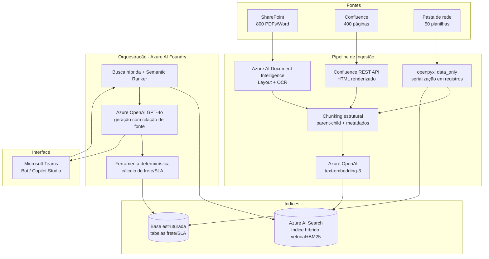

# Avaliação de Viabilidade Técnica — Assistente de IA NovaTech

**Cliente:** NovaTech (setor de logística, médio porte, 1.200 funcionários)
**Prestador:** DB1 Group
**Documento:** Technical Feasibility Assessment
**Versão:** 1.0 — Discovery
**Classificação:** Confidencial — uso interno DB1/NovaTech

---

## 1. Sumário Executivo

A NovaTech deseja um assistente de IA que permita aos 45 atendentes consultar, em linguagem natural, a documentação operacional oficial (manuais, políticas de compliance, tabelas de SLA, regras de frete e normas de segurança de carga), reduzindo o tempo médio de busca por chamado de **12 para menos de 2 minutos** e padronizando as respostas.

**Veredito:** o projeto é **tecnicamente viável** dentro do ecossistema Azure + Microsoft 365 já licenciado pela NovaTech, com arquitetura RAG (Retrieval-Augmented Generation) sobre Azure AI Search e Azure OpenAI (GPT-4o), integrado ao Teams. A viabilidade, contudo, é **condicionada** a dois fatores que estão fora da camada de modelo e são onde reside o maior risco do projeto:

1. **Heterogeneidade e qualidade das fontes** — tabelas complexas, PDFs escaneados, macros de Confluence e planilhas com fórmulas exigem um pipeline de ingestão sofisticado. RAG ingênuo (extração de texto puro + chunking fixo) produzirá respostas erradas em dados numéricos críticos (frete, SLA), o que é inaceitável em logística.
2. **Governança documental** — a base é atualizada mensalmente por três áreas sem processo unificado e **contém contradições entre versões**. Nenhum modelo de IA resolve fontes contraditórias: ele apenas reproduz a contradição com confiança. Este é um problema de processo, não de tecnologia, e precisa ser endereçado em paralelo.

A recomendação é prosseguir com o projeto adotando uma arquitetura **híbrida** (RAG para conteúdo narrativo + consulta estruturada/determinística para tabelas e cálculo de frete) e tratando a governança de fontes como entregável de primeira classe do discovery, não como detalhe operacional.

> **Observação sobre estimativas de custo e preços:** os valores de pricing de Azure citados na Seção 9 são aproximados e mudam com frequência. Devem ser confirmados na calculadora oficial da Microsoft e em proposta comercial dedicada antes de qualquer compromisso contratual.

---

## 2. Contexto e Escopo

| Item | Situação atual |
|---|---|
| Volume de chamados | ~320/dia; **~60% (192/dia)** envolvem consulta a documentação |
| Equipe impactada | 45 atendentes |
| Tempo médio de busca | 12 min/chamado → **meta: < 2 min** |
| Fontes | SharePoint (~800 PDFs/Word), Confluence (~400 páginas), pasta de rede (~50 planilhas, atualização mensal) |
| Atualização | Mensal, por Operações, Compliance e Comercial — **sem revisão unificada** |
| Licenciamento | Microsoft 365 E3 já contratado; disposição para provisionar Azure AI Services |
| Integração-alvo | Microsoft Teams + SharePoint |
| Prazo | 3 meses (discovery + desenvolvimento + go-live) |

**Fora de escopo nesta fase:** automação de respostas ao cliente final (o assistente apoia o atendente humano, não o substitui), reescrita da documentação de origem, e unificação técnica das três áreas produtoras de conteúdo.

---

## 3. Análise das Fontes de Dados

Esta é a seção de maior densidade de risco. Cada tipo de fonte impõe um desafio distinto ao pipeline de RAG. A regra central: **a qualidade da resposta nunca supera a qualidade da extração.** Se a etapa de ingestão corromper a estrutura de uma tabela de frete, nenhum reranker ou prompt salvará a resposta.

### 3.1 PDFs com tabelas complexas (tabelas de frete com 15+ colunas)

**Desafio para o pipeline.** Extratores de texto convencionais (PyPDF, pdfminer) leem o PDF como fluxo de caracteres e **perdem a topologia da tabela**: células se misturam entre linhas, o cabeçalho deixa de estar associado ao valor, e uma tabela de 15 colunas vira uma sopa de números sem rótulo. Ao fatiar (chunking) esse texto, a probabilidade de cortar uma tabela no meio é alta.

**Impacto na qualidade das respostas.** Crítico. Em logística, a resposta "qual o frete para a faixa de peso X, região Y, cliente tipo Z" depende da interseção exata linha×coluna. Uma tabela mal extraída produz a alucinação mais perigosa que existe: um **número plausível, porém errado**. O atendente não tem como auditar e repassa o valor ao cliente.

**Estratégia de tratamento.**
- Usar **Azure AI Document Intelligence (modelo Layout)** para extrair tabelas como objetos estruturados (linha/coluna/célula com coordenadas), não como texto corrido.
- **Serializar cada tabela para Markdown/HTML** preservando o cabeçalho, e manter a tabela inteira como **um único chunk** (table-aware chunking), repetindo o cabeçalho em cada fragmento caso a tabela seja grande demais para um chunk.
- Para as tabelas de frete de alto risco, ir além do RAG: extrair os dados para uma **base estruturada consultável** (ver Seção 6.3 e 7.4) e responder via lookup determinístico, não por similaridade vetorial.

### 3.2 PDFs escaneados (OCR necessário)

**Desafio para o pipeline.** Não há camada de texto — são imagens. Sem OCR, o documento é invisível para o RAG. Com OCR, surgem erros de reconhecimento, especialmente em **números, unidades e caracteres especiais** (um "0" vira "O", "8" vira "B"), exatamente os dados mais sensíveis em frete e SLA.

**Impacto na qualidade das respostas.** Duplo. Texto ruidoso gera **embeddings de baixa qualidade** (o chunk não é recuperado quando deveria) e, quando recuperado, **transporta o erro numérico** para a resposta.

**Estratégia de tratamento.**
- **Azure AI Document Intelligence (modelo Read/OCR)** com extração de **score de confiança** por região.
- **Quality gate na ingestão:** documentos ou trechos abaixo de um limiar de confiança são marcados (`needs_review`) e não entram no índice até validação humana, ou entram com flag de baixa confiança exibida na resposta.
- Inventariar quantos dos 800 PDFs são escaneados logo no discovery — isso muda materialmente o esforço de ingestão.

### 3.3 Wiki Confluence (links internos + macros customizadas)

**Desafio para o pipeline.** Dois problemas. (a) **Links internos** criam contexto distribuído: uma página de "política de devolução" pode depender de uma página linkada de "prazos por região"; ao fatiar isoladamente, o chunk perde a referência. (b) **Macros customizadas** renderizam conteúdo dinâmico em tempo de exibição — um export bruto traz a macro não-resolvida (ou vazia), e o conteúdo real nunca chega ao índice.

**Impacto na qualidade das respostas.** Respostas incompletas (faltando o contexto da página linkada) ou vazias (macro não-renderizada). O usuário recebe "não encontrei" para algo que existe.

**Estratégia de tratamento.**
- Ingerir via **Confluence REST API** obtendo o **HTML renderizado** (macros já resolvidas), e não o storage format bruto.
- **Chunking por hierarquia de cabeçalhos**, anexando *breadcrumb* (espaço > página > seção) como metadado de cada chunk para preservar o contexto navegacional.
- Mapear o **grafo de links internos** como metadado; em consultas complexas, permitir *retrieval* expandido para páginas diretamente vinculadas (1 salto).

### 3.4 Planilhas com fórmulas interdependentes

**Desafio para o pipeline.** O valor de uma célula é **resultado de uma fórmula**, não um texto. Se o pipeline extrair a fórmula (`=B2*VLOOKUP(...)`), o LLM recebe algo ininteligível; se extrair o valor sem contexto de rótulo, recebe um número solto. Além disso, números isolados produzem **embeddings semanticamente pobres** (vetores não capturam bem magnitude numérica), e a base muda **mensalmente**.

**Impacto na qualidade das respostas.** Alto e silencioso. O LLM **não calcula** de forma confiável; se a regra de frete depende de uma cadeia de fórmulas, recuperar e "pedir para o modelo calcular" é receita de erro.

**Estratégia de tratamento.**
- Extrair com **openpyxl em modo `data_only`** (valores já computados pelo Excel), não as fórmulas.
- **Converter cada tabela lógica em registros linha-a-linha** em linguagem natural ou Markdown ("Para cliente *Premium*, região *Sudeste*, peso até *10kg*: SLA = *24h*, frete = *R$ X*"), o que melhora embeddings e legibilidade.
- Para **regras de cálculo de frete**, tratar a planilha como **fonte de dados estruturada consultada por uma ferramenta determinística** (function calling / tool), em vez de confiar no LLM para aritmética. RAG responde "qual é a regra"; a ferramenta responde "qual é o valor".
- Pipeline de **reindexação incremental mensal** disparado pela atualização das planilhas.

### 3.5 Tabela-resumo

| Fonte | Desafio principal | Risco na resposta | Estratégia-chave |
|---|---|---|---|
| PDF c/ tabelas | Perda da topologia da tabela | Número plausível porém errado | Document Intelligence (Layout) + table-aware chunk + lookup estruturado |
| PDF escaneado | Sem texto; erro de OCR em números | Chunk não recuperado / erro numérico | OCR com score de confiança + quality gate |
| Wiki Confluence | Links + macros não resolvidas | Resposta incompleta/vazia | API REST (HTML renderizado) + breadcrumb + grafo de links |
| Planilha c/ fórmulas | Valor é resultado de fórmula | LLM "calcula" e erra | `data_only` + serialização em registros + ferramenta determinística |

---

## 4. Dimensionamento da Base de Conhecimento (em tokens)

Regra prática adotada: **~0,75 palavras por token** ⇒ `tokens = palavras ÷ 0,75`.

| Fonte | Quantidade | Premissa | Palavras | Tokens (aprox.) |
|---|---|---|---|---|
| PDFs | 800 docs × 10 pgs = 8.000 pgs | ~500 palavras/página | 4.000.000 | **~5,33 M** |
| Wiki | 400 páginas | 1.500 palavras/página | 600.000 | **~0,80 M** |
| Planilhas | 50 arquivos | ~8.000 palavras-equivalente/arquivo* | 400.000 | **~0,53 M** |
| **Total** | | | **5.000.000** | **~6,67 M tokens** |

\* A estimativa de planilhas é a **mais incerta** do conjunto, pois depende do número de linhas/abas e de como os dados tabulares são textualizados na ingestão. O valor real deve ser medido no discovery. As demais premissas (500 palavras/página de PDF) são conservadoras e típicas de documento corporativo denso.

**Leitura prática.** ~6,7 M tokens é uma base **pequena para vetorização** (Azure AI Search lida com isso confortavelmente), mas **~52× maior que a janela de contexto de 128K do GPT-4o**. Ou seja: é impossível e desnecessário "colocar tudo no prompt". Toda a engenharia do projeto consiste em selecionar, a cada pergunta, a pequena fração relevante — o que nos leva ao orçamento de contexto.

---

## 5. Análise de Orçamento de Contexto (Context Budget)

**Pergunta:** dado GPT-4o com janela de **128K tokens** e system prompt + instruções consumindo **~2K tokens**, quantos chunks de **~500 tokens** cabem por query?

### 5.1 Cálculo simples (teto bruto)

```
(128.000 − 2.000) ÷ 500 = 126.000 ÷ 500 = 252 chunks
```

### 5.2 Cálculo realista (orçamento honesto)

A janela não serve só para chunks. Ela é disputada por **vários ocupantes**, e a saída do modelo também consome janela:

| Ocupante | Tokens reservados |
|---|---|
| System prompt + instruções | 2.000 |
| Reserva para a resposta (saída) | 4.000 |
| Histórico da conversa (multi-turno) | ~6.000 |
| Pergunta do usuário | ~500 |
| **Disponível para chunks** | **~115.500** |

```
115.500 ÷ 500 ≈ 231 chunks teóricos
```

### 5.3 A conclusão que importa: *poder caber ≠ dever colocar*

Caber ~230 chunks **não significa** que devamos recuperar 230 chunks. Encher a janela tem três efeitos negativos:

1. **Diluição de precisão (signal-to-noise).** Quanto mais chunks irrelevantes entram, mais o modelo divide atenção e maior a chance de ancorar na informação errada.
2. **Lost in the middle** (Seção 7.3): informação no meio de contextos longos é efetivamente "esquecida". Encher 230 chunks coloca a maior parte do conteúdo na zona de baixa atenção.
3. **Custo e latência** crescem linearmente com tokens de entrada.

**Recomendação de orçamento de retrieval:** recuperar um conjunto amplo de candidatos (ex.: top-30 a top-50 por busca híbrida), **reranquear**, e enviar ao prompt apenas os **8 a 15 melhores chunks** (~4K–7,5K tokens). Isso mantém o contexto enxuto, de alta relevância e dentro da zona de boa atenção do modelo — usando ~5% da janela disponível em vez de saturá-la.

```
Pipeline:  busca híbrida (top 30–50)  →  reranker (semantic ranker)  →  top 8–15  →  prompt
```

---

## 6. Estratégia de Chunking Recomendada

A estratégia de chunking precisa ser justificada por **dois fatores**: (a) o tipo de pergunta que o atendente fará e (b) o fenômeno *lost in the middle*.

### 6.1 Que perguntas o atendente faz?

As consultas reais ("qual o SLA para cliente tipo X?", "qual a regra de frete para região Y?", "qual o procedimento de reclamação?", "qual a política de devolução?") são **factuais e localizadas**: a resposta correta vive em **uma seção específica, uma linha de tabela ou um parágrafo de procedimento**, não dispersa por um documento inteiro. Isso favorece chunks **pequenos e semanticamente coesos**, que maximizam precisão de recuperação — em vez de chunks gigantes que trazem ruído junto com o sinal.

### 6.2 Recomendação: chunking estrutural/semântico + hierárquico (parent-child)

Em vez de fatiamento de tamanho fixo cego, recomenda-se:

- **Chunking por estrutura** (heading-aware): cortar nos limites naturais do documento — seções, subtítulos, parágrafos — respeitando a semântica.
- **Tamanho-alvo ~500 tokens** com **overlap de ~10–15% (~50–75 tokens)** para não perder contexto nas fronteiras.
- **Tabelas nunca são fatiadas** no meio (table-aware): cada tabela é um chunk íntegro com cabeçalho.
- **Padrão parent-child (small-to-big):** indexar e buscar pelo **chunk pequeno** (alta precisão de match), mas entregar ao LLM o **chunk-pai** (a seção completa que dá contexto). Isso combina precisão de recuperação com suficiência de contexto.
- **Metadados ricos por chunk:** fonte, área produtora (Operações/Compliance/Comercial), **versão e data de vigência**, breadcrumb. Esses metadados são essenciais para o tratamento de contradições (Seção 8) e para citar a fonte.

### 6.3 Tratamento diferenciado por tipo de conteúdo

| Tipo de conteúdo | Estratégia de chunk |
|---|---|
| Texto narrativo (manuais, políticas) | Estrutural por cabeçalho, ~500 tokens, overlap, parent-child |
| Tabelas (frete, SLA) | Table-aware: tabela inteira como 1 chunk + cabeçalho replicado; **e** lookup estruturado paralelo |
| Wiki | Por hierarquia de seção + breadcrumb + metadado de links |
| Planilhas | Registro linha-a-linha em linguagem natural; lookup determinístico para cálculo |

### 6.4 Por que isso mitiga *lost in the middle*

O efeito *lost in the middle* mostra que LLMs recuperam bem a informação no **início e no fim** do contexto, mas degradam no meio. Nossa estratégia ataca isso em três frentes:

1. **Poucos chunks (8–15).** Com contexto curto, simplesmente **não existe um "meio" longo** onde a informação se perca.
2. **Reordenação por relevância.** Posicionar os chunks **mais relevantes nas extremidades** do bloco de contexto (os mais fortes no topo e na base, os medianos no meio), explorando deliberadamente as zonas de alta atenção.
3. **Alta precisão de recuperação** (chunks pequenos + reranker) reduz o número de chunks necessários para conter a resposta, reforçando os dois pontos acima.

---

## 7. Arquitetura de Solução Proposta (Azure + Microsoft 365)

A arquitetura é **híbrida**: RAG para conteúdo narrativo e consulta estruturada determinística para dados tabulares de alto risco.



**Componentes principais:**

- **Azure AI Document Intelligence** — extração de tabelas (Layout) e OCR (Read) com score de confiança.
- **Azure AI Search** — índice **híbrido** (vetorial + BM25 lexical) com **Semantic Ranker** para reordenação; suporta o padrão parent-child e filtros por metadado (área, versão, vigência).
- **Azure OpenAI** — `text-embedding-3` para vetorização; **GPT-4o** para geração com citação obrigatória da fonte.
- **Camada de ferramentas (function calling)** — consulta determinística às tabelas de frete/SLA; o LLM delega o cálculo em vez de fazê-lo.
- **Orquestração** — Azure AI Foundry (ou equivalente) para o fluxo retrieval → rerank → tool → geração.
- **Interface** — bot no **Teams** (Bot Framework ou Copilot Studio), aproveitando as licenças M365 E3 existentes; indexação respeitando permissões do SharePoint.

---

## 8. Riscos Críticos e Governança

### 8.1 Contradições entre versões — o maior risco do projeto

A documentação **se contradiz entre versões** e hoje a equipe resolve "perguntando para quem sabe". **Nenhuma técnica de IA resolve isso sozinha** — RAG recuperará ambas as versões contraditórias e o LLM apresentará uma delas (ou misturará as duas) com aparente confiança. O risco é **degradar a confiabilidade abaixo do processo manual atual**, minando a adoção.

**Mitigações (combinadas):**
- **Metadados de vigência e versão obrigatórios** em cada chunk; ranking com **priorização por recência** e filtro por documento vigente.
- **Detecção de conflito:** quando chunks recuperados divergem sobre o mesmo fato, o assistente **sinaliza a divergência e cita ambas as fontes** em vez de "escolher" silenciosamente.
- **Curadoria de "fonte única da verdade"** por domínio no discovery — definir, com Operações/Compliance/Comercial, qual documento é autoritativo para cada tema.
- **Recomendação estratégica:** propor à NovaTech um **processo mínimo de governança documental** (dono por documento, fluxo de revisão, depreciação de versões antigas). Sem isso, o assistente herda e amplifica o caos atual.

### 8.2 Outros riscos

| Risco | Severidade | Mitigação |
|---|---|---|
| Atualização mensal por 3 áreas sem processo | Alta | Pipeline de reindexação incremental + ownership de metadados |
| Alucinação em dados numéricos (frete/SLA) | Alta | Lookup determinístico + citação obrigatória + grounding estrito |
| PDFs escaneados em volume desconhecido | Média | Inventário no discovery; quality gate de OCR |
| Permissões/segurança no acesso a docs | Média | Indexação respeitando ACLs do SharePoint; segregação por perfil |
| Baixa adoção por desconfiança | Média | Citação visível da fonte + sinalização de incerteza + piloto controlado |

---

## 9. Estimativa de Custos (aproximada — confirmar)

> Os preços de Azure variam por região, tier e data. Os números abaixo são **ordens de grandeza** para dimensionamento, **não cotação**. Validar na calculadora oficial Microsoft.

**Volume de consultas:** ~192 chamados/dia com consulta × ~21 dias úteis ≈ **~4.000 queries/mês**.

| Item | Natureza | Estimativa de ordem de grandeza |
|---|---|---|
| Embeddings (indexação inicial 6,7M tokens) | One-time | Baixo (centavos a poucos dólares com `text-embedding-3-small`) |
| Azure OpenAI GPT-4o (geração) | Recorrente | Dezenas de USD/mês (≈ 4.000 queries × ~6,5K entrada + 0,5K saída) |
| Azure AI Search (tier Standard) | Recorrente | Centenas de USD/mês conforme tier/réplicas |
| Document Intelligence | One-time alto + recorrente baixo | Proporcional ao nº de páginas processadas (atenção a PDFs escaneados) |
| Reindexação mensal (deltas) | Recorrente | Baixo |

O **maior custo recorrente** tende a ser o tier do Azure AI Search, não o consumo do LLM — o volume de queries é modesto. O **maior custo one-time** é a ingestão inicial (Document Intelligence sobre 8.000 páginas + tratamento de escaneados).

---

## 10. Caso de Negócio (ROI)

| Métrica | Valor |
|---|---|
| Chamados/dia com consulta | 192 |
| Redução de tempo por chamado | 10 min (de 12 para 2) |
| Tempo recuperado/dia | **32 horas** |
| Tempo recuperado/mês (21 dias) | **~672 horas** |
| Tempo recuperado/ano (252 dias) | **~8.064 horas** |

Além do ganho de tempo quantificável, há benefícios qualitativos relevantes: **consistência** das respostas (fim do "cada atendente responde de um jeito"), **redução da dependência de pessoas-chave** ("perguntar para quem sabe"), e **rastreabilidade** (toda resposta com fonte citada). A meta da diretoria (< 2 min) é plausível para consultas factuais bem cobertas pela base — desde que governança e ingestão sejam bem executadas.

---

## 11. Roadmap de 3 Meses

**Mês 1 — Discovery e fundação**
- Inventário das fontes: quantos PDFs escaneados, complexidade das planilhas, mapa de macros do Confluence.
- Curadoria de fonte única da verdade por domínio; definição do processo mínimo de governança.
- Setup do ambiente Azure; prova de conceito de ingestão de tabelas de frete (o caso mais arriscado primeiro).

**Mês 2 — Pipeline e RAG**
- Pipeline de ingestão completo (Document Intelligence, Confluence API, planilhas).
- Índice híbrido + chunking estrutural/parent-child + reranking.
- Ferramenta determinística de frete/SLA; integração de geração com citação de fonte.
- Bateria de avaliação (golden set de perguntas reais dos atendentes).

**Mês 3 — Integração, piloto e go-live**
- Bot no Teams; controle de permissões.
- **Piloto com subgrupo de atendentes**; medição do tempo real de busca vs. meta.
- Ajuste de chunking/retrieval com base no golden set; go-live e plano de reindexação mensal.

---

## 12. Recomendações e Próximos Passos

1. **Prosseguir** — o projeto é viável no stack Azure/M365 da NovaTech.
2. **Tratar governança documental como entregável**, não como detalhe — é o principal determinante de sucesso ou fracasso.
3. **Adotar arquitetura híbrida** (RAG + lookup determinístico) para nunca confiar ao LLM o cálculo de frete/SLA.
4. **Priorizar o caso mais arriscado no discovery** (tabelas de frete + PDFs escaneados) para validar viabilidade de ingestão cedo.
5. **Definir métricas de aceite** desde o início: tempo médio de busca, taxa de respostas com fonte correta, taxa de "não sei" honestos vs. alucinações — medidos sobre um golden set de perguntas reais.

---

*Documento elaborado por DB1 Group como avaliação de viabilidade técnica (discovery). Estimativas de custo e premissas de dimensionamento devem ser confirmadas com inventário real das fontes e cotação Azure dedicada antes de compromisso contratual.*